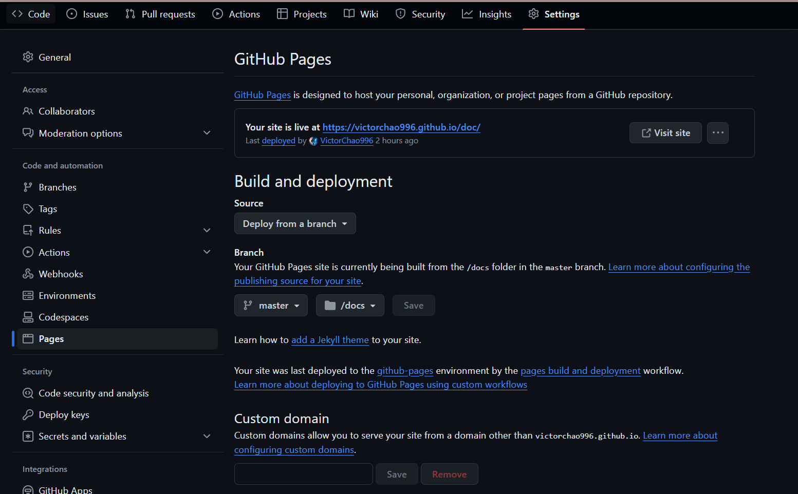

# GitHub Pages
- [GitHub Pages](#github-pages)
  - [Intro](#intro)
  - [notes](#notes)
  - [Reference](#reference)
---

## Intro
GitHub 官方提供的服務，讓使用者可以透過 Github repo 快速部屬網站。

## notes
- 每個帳號有自己的專屬域名:  `https://<username>.github.io.`
- 最簡單的方法，創建一個名為 "username".github.io 的公開 repo，並 push 內容到該 repo 中，github actions 就會在自動部屬網站到上述帳號專屬域名中
- 原本以為每個帳號只能使用一個 gitHub pages (也就是只能使用上面的 .github.io 同名 repo)，後來爬到可以設置多個 pages 的方法 ([reference-1](#reference))，設定方法如下:    
    >1. Go to the repository where you want to have Github Pages
    >2. Go to the Settings tab
    >3. On the left, under Code and automation, go to Pages
    >4. Under Build and deployment, make sure Source is set to Deploy from a branch
    >5. In the same spot, set Branch to the branch where you have your mod
    >6. wait for the github actions to set the deploy.
    >7. DONE!

- github pages 也可以使用自己的域名: 

!>除了 `<username>.github.io` repo 產生的網站會部屬在 `https://<username>.github.io`，其餘公開設置好的 repo 預設會使用 `https://<username>.github.io/<repoName>` 作為網站連結。 **要特別注意 route 的問題**。

- 利用上述自動部屬命名的特性即可將 blog 與 doc repo 分開維護與部屬，最後再從 main page (`https://<username>.github.io`) 上設定指向實體連結的跳轉方式即可前往個人 blog & doc 網站。

## Reference
- [Is it possible to use more than one repository in github page? #58767](https://github.com/orgs/community/discussions/58767)
- [GitHub Pages](https://pages.github.com/)

